# TRƯỜNG ĐẠI HỌC KIÊN GIANG

## KHOA THÔNG TIN VÀ TRUYỀN THÔNG

**ĐOÀN HOÀNG VŨ**  
**MÃ SỐ SINH VIÊN: 23092006246**

# XÂY DỰNG PHẦN MỀM KHÁM BỆNH CHO PHÒNG KHÁM TRUNG CANG

## THỰC TẬP NGHỀ NGHIỆP

**NGÀNH: CÔNG NGHỆ THÔNG TIN (MÃ SỐ: 7480201)**  
**GIẢNG VIÊN HƯỚNG DẪN: ThS. Châu Ngọc Nhung**

*An Giang – tháng 10 năm 2026*

\newpage

# LỜI CẢM ƠN

Trong quá trình thực tập và thực hiện báo cáo với đề tài “Xây dựng phần mềm khám bệnh cho Phòng khám Trung Cang”, em đã nhận được sự hướng dẫn và hỗ trợ tận tình từ cô Châu Ngọc Nhung cùng các anh chị tại đơn vị thực tập.

Em xin chân thành cảm ơn quý thầy cô Trường Đại học Kiên Giang đã truyền đạt kiến thức chuyên ngành cần thiết. Em cũng xin cảm ơn Ban lãnh đạo và các anh chị tại VNPT An Giang đã tạo điều kiện để em tiếp cận công việc thực tế, tìm hiểu quy trình hỗ trợ và vận hành phần mềm trong lĩnh vực y tế.

Do kiến thức và kinh nghiệm thực tế còn hạn chế, báo cáo không tránh khỏi thiếu sót. Em kính mong nhận được sự góp ý của quý thầy cô để tiếp tục hoàn thiện.

*An Giang, ngày ..... tháng ..... năm 2026*  
*Sinh viên thực hiện*  
**Đoàn Hoàng Vũ**

\newpage

# LỜI CAM ĐOAN

Tôi cam đoan đề tài này do chính tôi thực hiện. Các số liệu kiểm thử, kết quả phân tích và nội dung trình bày trong báo cáo là trung thực; đề tài không sao chép toàn bộ từ bất kỳ công trình nghiên cứu nào khác. Các tài liệu và nguồn tham khảo được ghi nhận trong phần tài liệu tham khảo.

*Kiên Giang, ngày ..... tháng ..... năm 2026*  
*Sinh viên thực hiện*  
**Đoàn Hoàng Vũ**

\newpage

# NHẬN XÉT CỦA ĐƠN VỊ THỰC TẬP

........................................................................................................................

........................................................................................................................

........................................................................................................................

........................................................................................................................

........................................................................................................................

*...................., ngày ..... tháng ..... năm ......*  
*XÁC NHẬN CỦA CƠ QUAN THỰC TẬP*  
*CÁN BỘ HƯỚNG DẪN*

\newpage

# NHẬN XÉT CỦA GIẢNG VIÊN HƯỚNG DẪN

........................................................................................................................

........................................................................................................................

........................................................................................................................

........................................................................................................................

........................................................................................................................

*...................., ngày ..... tháng ..... năm ......*  
*GIẢNG VIÊN HƯỚNG DẪN*

\newpage

# DANH MỤC CÁC TỪ VIẾT TẮT

| Viết tắt | Diễn giải |
|---|---|
| API | Application Programming Interface – giao diện lập trình ứng dụng |
| CLS | Cận lâm sàng |
| CRUD | Create, Read, Update, Delete – tạo, đọc, sửa, xóa |
| ERD | Entity Relationship Diagram – sơ đồ thực thể liên kết |
| HIS | Hospital Information System – hệ thống thông tin bệnh viện |
| JPA | Java Persistence API |
| MVC | Model – View – Controller |
| UI | User Interface – giao diện người dùng |

\newpage

# CHƯƠNG 1. TỔNG QUAN ĐƠN VỊ THỰC TẬP

## 1.1. Giới thiệu về đơn vị thực tập

### 1.1.1. Tổng quan về Tập đoàn Bưu chính Viễn thông Việt Nam

Tập đoàn Bưu chính Viễn thông Việt Nam (VNPT) là doanh nghiệp hoạt động trong lĩnh vực viễn thông và công nghệ thông tin. Bên cạnh hạ tầng viễn thông, VNPT cung cấp các giải pháp số phục vụ cơ quan nhà nước, tổ chức, doanh nghiệp và người dân. Các giải pháp này được triển khai trong nhiều lĩnh vực, trong đó có y tế.

Ứng dụng công nghệ thông tin trong y tế có ý nghĩa quan trọng vì cơ sở khám chữa bệnh phải quản lý thông tin người bệnh, lượt khám, thuốc, dịch vụ và hồ sơ chuyên môn. Hệ thống phần mềm giúp chuẩn hóa thao tác, hỗ trợ tra cứu và giảm việc quản lý thông tin rời rạc.

### 1.1.2. Đơn vị thực tập

Em thực hiện thực tập nghề nghiệp tại **VNPT An Giang**. Thông tin được sử dụng theo mẫu báo cáo:

| Nội dung | Thông tin |
|---|---|
| Đơn vị thực tập | VNPT An Giang |
| Địa chỉ | 25 Điện Biên Phủ, Rạch Giá, An Giang |
| Thời gian thực tập | Từ ngày 15/07/2026 đến ngày 24/10/2026 |
| Bộ phận thực tập | Nhóm giải pháp HIS L2, Văn phòng CNTT |
| Người hướng dẫn tại đơn vị | Huỳnh Phú Điền |

Trong thời gian thực tập, em được tiếp cận công việc hỗ trợ triển khai, hướng dẫn sử dụng và tìm hiểu nghiệp vụ phần mềm y tế. Đây là cơ hội để vận dụng kiến thức về lập trình web, cơ sở dữ liệu và phân tích hệ thống vào một bài toán thực tế.

## 1.2. Lĩnh vực hoạt động của đơn vị

### 1.2.1. Lĩnh vực viễn thông

Viễn thông là lĩnh vực nền tảng của VNPT, cung cấp hạ tầng kết nối và truyền dẫn dữ liệu. Hạ tầng này tạo điều kiện cho các hệ thống phần mềm hoạt động ổn định tại nhiều địa điểm sử dụng.

### 1.2.2. Lĩnh vực công nghệ thông tin

VNPT phát triển và cung cấp các giải pháp công nghệ thông tin phục vụ quản lý, điều hành và chuyển đổi số. Phần mềm hỗ trợ số hóa quy trình, tập trung dữ liệu và giảm các thao tác thủ công.

### 1.2.3. Lĩnh vực chuyển đổi số

Chuyển đổi số là việc ứng dụng công nghệ vào hoạt động của tổ chức nhằm tăng khả năng quản lý, xử lý và khai thác dữ liệu. Trong lĩnh vực y tế, chuyển đổi số hỗ trợ liên kết thông tin giữa các khâu tiếp nhận, khám bệnh, thanh toán và cấp phát thuốc.

### 1.2.4. Lĩnh vực giải pháp công nghệ cho y tế

Giải pháp công nghệ y tế hỗ trợ quản lý hoạt động khám chữa bệnh, từ tiếp nhận người bệnh đến lưu trữ hồ sơ và tra cứu lịch sử. Những quan sát từ hệ thống HIS L2 là cơ sở thực tế để hình thành đề tài phần mềm khám bệnh cho Phòng khám Trung Cang.

## 1.3. Nội dung thực tập tại đơn vị

### 1.3.1. Tìm hiểu hệ thống HIS L2

Trong quá trình thực tập, em tìm hiểu các phân hệ và quy trình cơ bản của hệ thống HIS L2. Nội dung tập trung vào mối liên hệ giữa hồ sơ người bệnh, lượt khám, khám bệnh, thuốc, dịch vụ và các bước hỗ trợ người dùng.

### 1.3.2. Hỗ trợ triển khai phần mềm

Em được tiếp cận quy trình triển khai phần mềm tại cơ sở y tế, gồm chuẩn bị danh mục, cấu hình cơ bản, kiểm tra thao tác và hỗ trợ xử lý các tình huống sử dụng thường gặp. Quá trình này giúp em hiểu rõ yêu cầu dữ liệu và vai trò của phân quyền trong hệ thống y tế.

### 1.3.3. Hướng dẫn người dùng sử dụng phần mềm

Nội dung thực tập bao gồm quan sát và hỗ trợ hướng dẫn người dùng thao tác theo quy trình nghiệp vụ. Qua đó, em nhận thấy giao diện cần rõ ràng, phù hợp vai trò người dùng và hạn chế sai sót khi nhập liệu.

## 1.4. Kiến thức và kỹ năng đạt được trong quá trình thực tập

### 1.4.1. Kiến thức chuyên môn

Em củng cố kiến thức về phân tích nghiệp vụ, phát triển ứng dụng web Java, thiết kế cơ sở dữ liệu quan hệ, API và kiểm thử phần mềm. Các kiến thức này được vận dụng trong quá trình xây dựng TrungCang HIS.

### 1.4.2. Kỹ năng phân tích nghiệp vụ

Quá trình quan sát nghiệp vụ giúp em nhận diện được luồng thông tin giữa tiếp nhận, khám bệnh, thu viện phí và cấp phát. Khi xây dựng hệ thống, mỗi bước được mô hình hóa bằng trạng thái và dữ liệu liên quan.

### 1.4.3. Kỹ năng giao tiếp và hỗ trợ người dùng

Việc tiếp cận hoạt động hỗ trợ người dùng giúp em rèn luyện cách lắng nghe yêu cầu, mô tả thao tác ngắn gọn và phản hồi theo ngữ cảnh nghiệp vụ.

### 1.4.4. Kỹ năng làm việc trong môi trường doanh nghiệp

Em rèn luyện thói quen ghi nhận công việc, kiểm tra thay đổi bằng test và phối hợp giữa yêu cầu nghiệp vụ với giới hạn kỹ thuật. Đây là cơ sở để tổ chức mã nguồn và tài liệu rõ ràng hơn.

## 1.5. Nhận xét về quá trình thực tập

Thực tập tại đơn vị giúp em kết nối kiến thức học thuật với nhu cầu thực tế của phần mềm y tế. Đề tài được xây dựng ở quy mô mô phỏng cho phòng khám, tập trung vào quy trình ngoại trú và các chức năng có thể kiểm thử trong phạm vi thực tập.

## 1.6. Kết luận chương

Chương 1 đã giới thiệu đơn vị thực tập, lĩnh vực hoạt động, nội dung công việc và các kiến thức, kỹ năng thu nhận được. Những trải nghiệm này là cơ sở để lựa chọn và triển khai đề tài phần mềm khám bệnh cho Phòng khám Trung Cang ở các chương tiếp theo.

\newpage

# CHƯƠNG 2. TỔNG QUAN ĐỀ TÀI

## 2.1. Giới thiệu đề tài

### 2.1.1. Tên đề tài

Đề tài có tên **“Xây dựng phần mềm khám bệnh cho Phòng khám Trung Cang”**. Sản phẩm có tên hiển thị là **TrungCang HIS**, là ứng dụng web mô phỏng quy trình khám ngoại trú ở quy mô phòng khám.

### 2.1.2. Bối cảnh hình thành đề tài

Quy trình khám bệnh có nhiều bước liên quan: tiếp nhận người bệnh, khám, chẩn đoán, kê đơn, thanh toán và cấp phát. Nếu các bước được lưu trữ rời rạc, việc tra cứu lịch sử và đối soát thông tin sẽ khó khăn. Từ trải nghiệm thực tập và nhu cầu mô phỏng quy trình phòng khám, đề tài tập trung xây dựng một hệ thống web quản lý các nghiệp vụ cốt lõi.

## 2.2. Lý do chọn đề tài

Phần mềm y tế là bài toán có tính thực tế, yêu cầu dữ liệu liên kết và phân quyền rõ ràng. Đề tài giúp vận dụng kiến thức về Java, Spring Boot, cơ sở dữ liệu quan hệ, giao diện web và kiểm thử; đồng thời thể hiện sự liên kết giữa hồ sơ người bệnh, lượt khám, đơn thuốc và tồn kho.

## 2.3. Bài toán cần giải quyết

Hệ thống hỗ trợ các vai trò thực hiện công việc trên cùng một nguồn dữ liệu nghiệp vụ. Lễ tân tạo hoặc cập nhật hồ sơ người bệnh và đưa vào hàng chờ. Bác sĩ ghi nhận khám bệnh, ICD, thuốc và vật tư. Dược sĩ/thu ngân xác nhận thanh toán và cấp phát. Quản trị viên quản lý nhân viên, phòng và danh mục. Sau khi hoàn tất, hệ thống lưu dữ liệu khám để tra cứu lịch sử và tổng hợp báo cáo sử dụng thuốc.

## 2.4. Mục tiêu của đề tài

### 2.4.1. Mục tiêu tổng quát

Xây dựng ứng dụng web hỗ trợ quản lý quy trình khám ngoại trú cơ bản cho Phòng khám Trung Cang, có xác thực, phân quyền, lưu trữ dữ liệu và kiểm thử được các luồng chính.

### 2.4.2. Mục tiêu cụ thể

- Xác thực phiên đăng nhập và phân quyền bốn nhóm: Quản trị viên, Lễ tân, Bác sĩ và Dược sĩ.
- Quản lý nhân viên, khoa/phòng, bệnh nhân, ICD, danh mục hàng hóa và lô tồn.
- Hỗ trợ khám bệnh, kê thuốc, chỉ định vật tư, thanh toán và cấp phát.
- Tra cứu lịch sử khám, quản lý kho thuốc/kho vật tư và báo cáo sử dụng thuốc.
- Kiểm tra validation, API và giao diện bằng test tự động.

## 2.5. Đối tượng sử dụng hệ thống

### 2.5.1. Quản trị viên

Quản trị viên có quyền quản lý nhân viên, phòng, kho và báo cáo; đồng thời có thể truy cập các phân hệ nghiệp vụ khác theo cấu hình phân quyền.

### 2.5.2. Nhân viên tiếp nhận

Lễ tân đăng nhập, tạo hoặc cập nhật hồ sơ bệnh nhân, chọn phòng khám và theo dõi danh sách tiếp nhận trong ngày. Lễ tân được xem lịch sử khám và báo cáo theo quyền được cấu hình.

### 2.5.3. Bác sĩ

Bác sĩ thực hiện khám, nhập dấu hiệu sinh tồn, triệu chứng, chẩn đoán ICD, thuốc, vật tư và hoàn tất khám để chuyển sang bước thanh toán.

### 2.5.4. Dược sĩ

Dược sĩ xử lý danh sách chờ thanh toán/cấp phát theo giao diện hiện tại, xác nhận phát thuốc hoặc vật tư, quản lý kho và xem báo cáo.

## 2.6. Phạm vi của đề tài

### 2.6.1. Phạm vi nghiệp vụ đã triển khai

Phạm vi thực tế gồm đăng nhập, phân quyền, quản lý nhân viên, phòng, bệnh nhân; khám và lưu hồ sơ; danh mục ICD/thuốc; thanh toán; cấp phát; tồn kho theo lô; lịch sử khám; báo cáo có lọc ngày, phòng, trạng thái, hình thức thanh toán và hàng hóa. Báo cáo xuất được CSV, JSON hoặc HTML.

### 2.6.2. Phạm vi kỹ thuật

Ứng dụng dùng Java 21 và Spring Boot, giao diện Thymeleaf/Bootstrap/JavaScript, JPA với MySQL. Bộ test dùng H2 trong bộ nhớ để không làm ảnh hưởng database thật.

### 2.6.3. Những nội dung chưa hoàn thiện hoặc chưa tích hợp

Hàng chờ tiếp nhận và hàng chờ khám đang dùng `localStorage` trên trình duyệt; lượt khám được lưu khi bác sĩ hoàn tất khám. Danh mục dịch vụ y tế, chỉ định dịch vụ và kết quả dịch vụ có controller CRUD nhưng chưa được tích hợp vào luồng thanh toán. Hệ thống chưa triển khai bảo hiểm y tế, nội trú, ký số, in chứng từ, liên thông LIS/PACS hoặc đặt lịch trực tuyến.

## 2.7. Quy trình hoạt động thực tế

Luồng chính của phiên bản hiện tại là: **tiếp nhận → hàng chờ trình duyệt → khám và lưu hồ sơ → chờ thanh toán → chờ cấp phát → hoàn tất**. Sau cấp phát, số lượng của các lô thuốc/vật tư được giảm theo số lượng đã chỉ định. Hình 4.5 trình bày chi tiết luồng thanh toán và cấp phát.

## 2.8. Kết quả đạt được

Mã nguồn hiện có 19 entity JPA, 20 controller và các lớp service/repository tương ứng. Kiểm thử Maven hiện đạt 40 test, và hai nhóm test JavaScript đạt 13 test. Kiểm thử Playwright sẽ được chụp lại trên H2 TEST để minh họa ở Chương 5.

## 2.9. Ý nghĩa của đề tài

Đề tài cung cấp mô hình thực hành để liên kết kiến thức phân tích hệ thống với phát triển phần mềm web. Sản phẩm không được xem là hệ thống HIS hoàn chỉnh để triển khai thực tế, nhưng là nền tảng mô phỏng có thể tiếp tục phát triển.

## 2.10. Hướng phát triển

Các ưu tiên phát triển tiếp theo là chuyển hàng chờ sang database, tích hợp dịch vụ/cận lâm sàng vào hóa đơn, bổ sung in chứng từ, tăng kiểm soát tồn kho, và mở rộng bảo mật/kiểm toán theo yêu cầu vận hành thực tế.

## 2.11. Kết luận chương

Chương 2 đã xác định bài toán, mục tiêu, phạm vi và giới hạn thực tế của TrungCang HIS. Đây là cơ sở để trình bày nền tảng kỹ thuật và thiết kế hệ thống ở các chương sau.

\newpage

# CHƯƠNG 3. CƠ SỞ LÝ THUYẾT

## 3.1. Ứng dụng web nhiều tầng

Ứng dụng web được tổ chức theo các lớp giao diện, điều khiển, nghiệp vụ và truy cập dữ liệu. Cách tổ chức này giúp tách trách nhiệm: giao diện nhận thao tác người dùng; controller tiếp nhận yêu cầu; service xử lý nghiệp vụ; repository làm việc với database.

## 3.2. Java và Spring Boot

Java là ngôn ngữ hướng đối tượng được sử dụng cho backend. Spring Boot hỗ trợ khởi tạo ứng dụng, cấu hình web, dependency injection và tích hợp các starter. Trong đề tài, các annotation như `@RestController`, `@Service`, `@Entity` và `@Repository` giúp tổ chức mã nguồn theo từng trách nhiệm.

## 3.3. Spring MVC và Thymeleaf

Spring MVC tiếp nhận HTTP request và điều hướng trang. `ClientPageController` trả về các template giao diện; các controller REST cung cấp API dưới `/api`. Thymeleaf dùng để render khung trang và hiển thị điều hướng theo vai trò; JavaScript gọi API để nạp dữ liệu động.

## 3.4. JPA và cơ sở dữ liệu quan hệ

JPA ánh xạ class Java thành bảng dữ liệu. Quan hệ giữa bệnh nhân, lượt khám, hồ sơ khám, đơn thuốc và lô hàng được biểu diễn bằng khóa ngoại. MySQL là database chạy ứng dụng; H2 chỉ được dùng trong test để cô lập dữ liệu.

## 3.5. Xác thực, phân quyền và validation

Spring Security xác thực tài khoản từ bảng `users`, tạo phiên đăng nhập và kiểm tra quyền theo role. Mật khẩu được mã hóa BCrypt. Validation được thực hiện ở biểu mẫu và API nhằm hạn chế dữ liệu không hợp lệ; tuy nhiên phần CSRF hiện được cấu hình chặt cho thao tác quản lý nhân viên, là điểm cần rà soát thêm khi mở rộng API.

## 3.6. Kiểm thử phần mềm

JUnit/Spring Boot Test kiểm tra lớp backend trên H2. Test JavaScript kiểm tra logic ngày tiếp nhận và validation. Playwright được dùng để kiểm tra giao diện, luồng nghiệp vụ, API và lỗi console trong môi trường H2. Các phương pháp này hỗ trợ phát hiện lỗi trước khi tác động dữ liệu thật.

## 3.7. Kết luận chương

Các nền tảng trên đáp ứng yêu cầu xây dựng ứng dụng web có dữ liệu quan hệ, phân quyền và quy trình nghiệp vụ liên kết. Chương 4 trình bày cách các nền tảng được áp dụng vào thiết kế TrungCang HIS.

\newpage

# CHƯƠNG 4. PHÂN TÍCH VÀ THIẾT KẾ HỆ THỐNG

## 4.1. Phân tích yêu cầu

Yêu cầu chức năng được chia theo vai trò và luồng nghiệp vụ. Quản trị viên quản lý nhân viên, phòng, kho và báo cáo. Lễ tân quản lý hồ sơ và tiếp nhận. Bác sĩ hoàn tất khám, ICD, thuốc và vật tư. Dược sĩ xử lý thanh toán/cấp phát theo quyền cấu hình. Các yêu cầu phi chức năng gồm xác thực phiên, phân quyền URL/API, validation đầu vào, tra cứu lịch sử khám và khả năng kiểm thử không làm ảnh hưởng MySQL thật.

## 4.2. Kiến trúc hệ thống

Hệ thống sử dụng kiến trúc web nhiều tầng. Trình duyệt tải template Thymeleaf, CSS và JavaScript; JavaScript gọi REST API. Controller nhận yêu cầu, service xử lý nghiệp vụ và repository truy cập JPA/MySQL. H2 chỉ được dùng khi test. Sơ đồ nguồn: `diagrams/architecture.puml`.

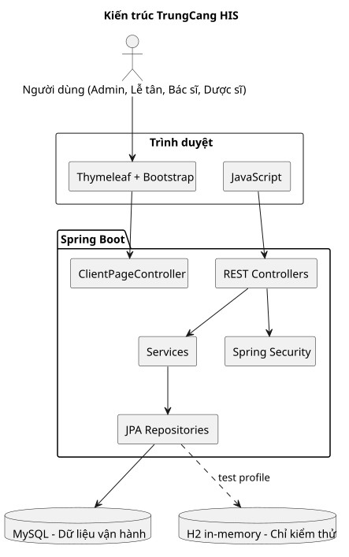

## 4.3. Use Case hệ thống

Sơ đồ Use Case mô tả đúng bốn vai trò đã được cấu hình trong `SecurityConfig`. Để tránh chồng chéo, sơ đồ được tách thành nghiệp vụ khám ngoại trú và quản trị/kho/báo cáo. Các chức năng dịch vụ/cận lâm sàng không đưa vào luồng thanh toán vì source chưa tích hợp. Sơ đồ nguồn: `diagrams/use-case-overview.puml` và `diagrams/use-case-administration.puml`.

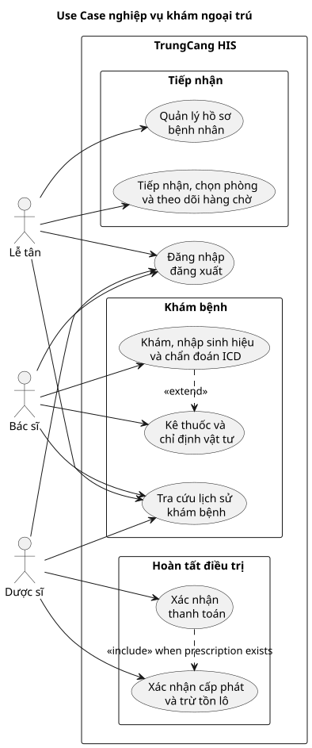

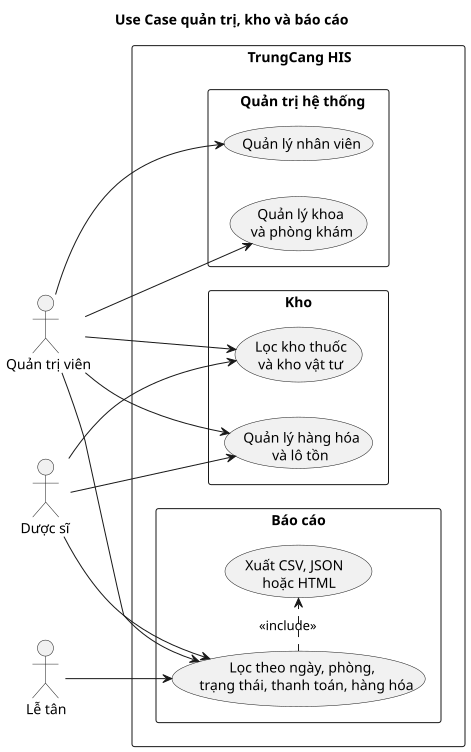

## 4.4. Thiết kế dữ liệu

Database có các nhóm bảng chính: người dùng/role; bệnh nhân/lượt khám; hồ sơ khám/chẩn đoán; đơn thuốc/chi tiết đơn/lô tồn; hóa đơn/chi tiết hóa đơn; dịch vụ/chỉ định/kết quả. ERD tập trung vào liên kết chính nhằm giữ sơ đồ dễ đọc. Sơ đồ nguồn: `diagrams/erd-core.puml`.

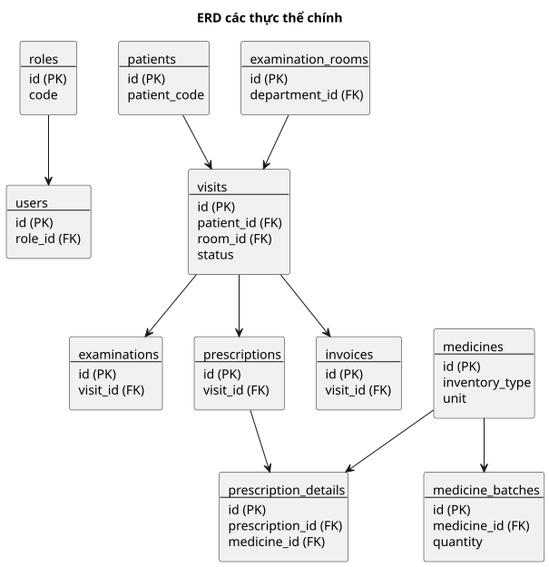

## 4.5. Thiết kế quy trình nghiệp vụ

Khi bác sĩ hoàn tất khám, service lưu lượt khám, hồ sơ, chẩn đoán và đơn trong transaction. Sau thanh toán, trạng thái chuyển chờ cấp phát. Khi xác nhận cấp phát, hệ thống trừ số lượng lô theo thuốc/vật tư đã chỉ định. Phần tiếp nhận/hàng chờ vẫn phụ thuộc `localStorage`; đây là giới hạn thể hiện rõ trong sơ đồ. Nguồn sơ đồ: `diagrams/activity-clinical-flow.puml` và `diagrams/activity-payment-dispense.puml`.

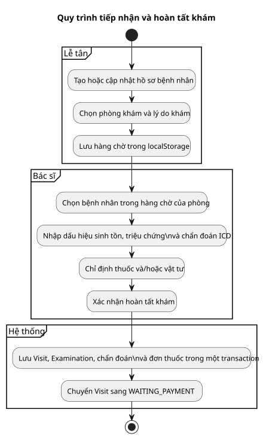

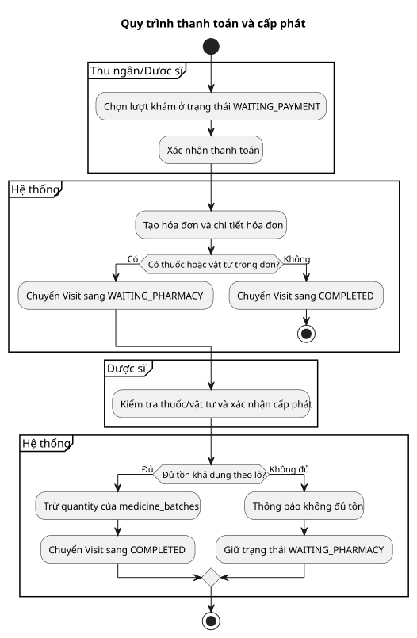

## 4.6. Thiết kế phân quyền

`SecurityConfig` bảo vệ template trực tiếp, URL màn hình và API theo vai trò. Menu chỉ hiển thị chức năng phù hợp, nhưng kiểm tra quyền quan trọng vẫn diễn ra phía server. Tài khoản lấy từ database và mật khẩu dùng BCrypt.

## 4.7. Kết luận chương

Thiết kế hiện tại đáp ứng mô hình nhiều tầng và liên kết dữ liệu cho quy trình ngoại trú cơ bản. Các giới hạn localStorage và phần CLS chưa tích hợp được giữ lại để định hướng phát triển, không được xem là chức năng hoàn chỉnh.

\newpage

# CHƯƠNG 5. CHƯƠNG TRÌNH ỨNG DỤNG

## 5.1. Tổ chức chương trình

Mã nguồn backend đặt tại `src/main/java/com/trungcang/trung_cang_his`, chia thành `config`, `controller`, `domain`, `repository`, `service` và `validation`. Template giao diện Thymeleaf đặt trong `src/main/webapp/WEB-INF/client`, fragment dùng chung nằm trong `WEB-INF/fragments`; CSS và JavaScript đặt trong `src/main/webapp/resources`. Maven sao chép các tài nguyên này vào `templates` và `static/resources` khi build.

## 5.2. Đăng nhập và phân quyền

Người dùng đăng nhập tại `/login`. API xác thực tạo session; `SecurityConfig` kiểm soát URL/API theo role và menu chỉ hiển thị chức năng phù hợp. Validation của biểu mẫu chặn gửi thông tin bắt buộc rỗng.

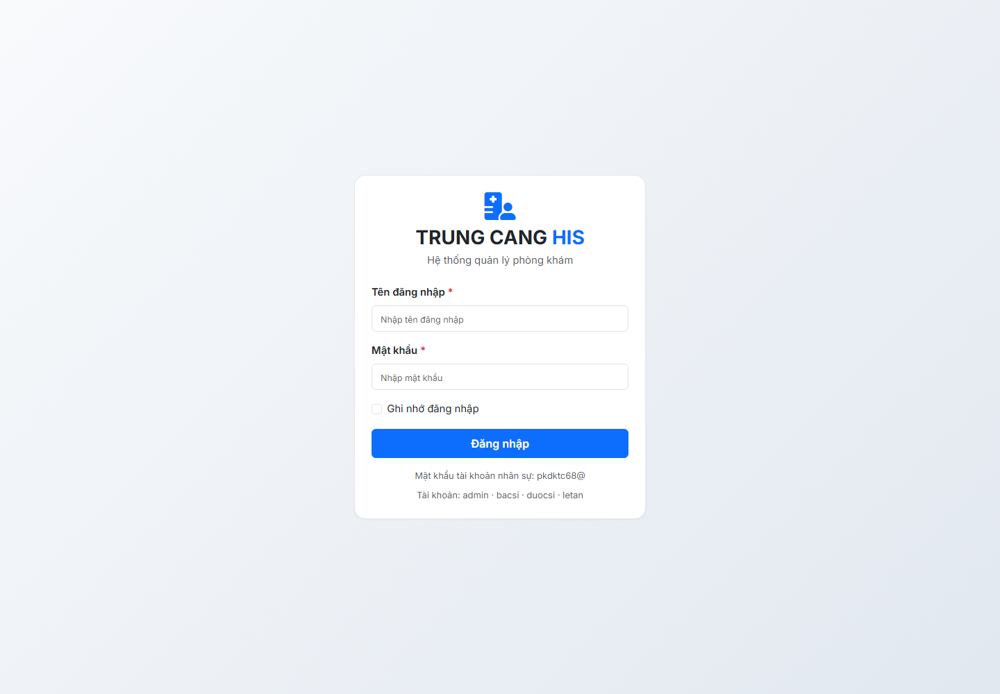

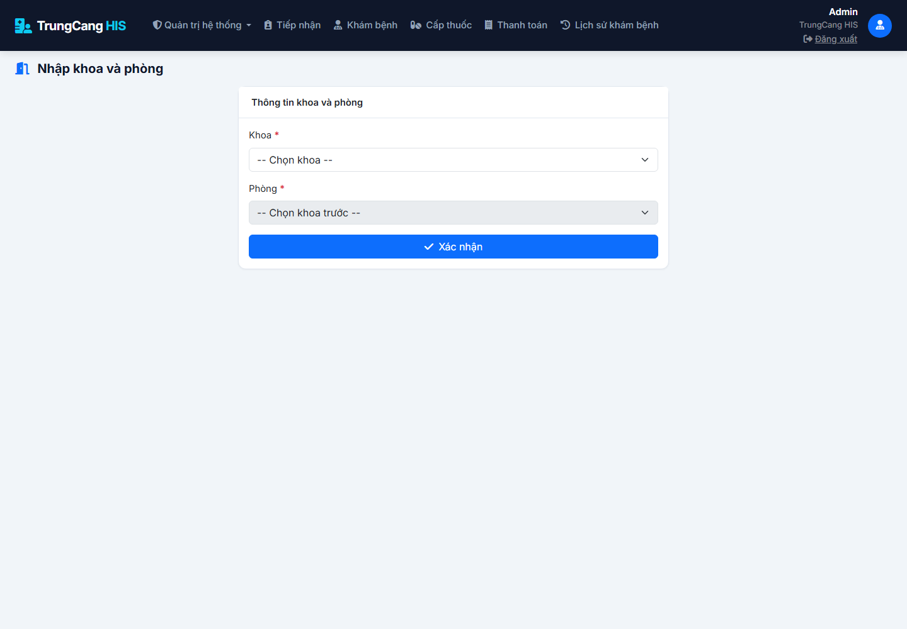

## 5.3. Tiếp nhận và khám bệnh

Trang tiếp nhận cho phép tạo/cập nhật hồ sơ và chọn phòng khám. Trong phiên bản hiện tại, hàng chờ được duy trì bằng `localStorage`; vì vậy ảnh chỉ minh họa giao diện TEST, không dùng dữ liệu người bệnh thật. Trang khám hỗ trợ sinh hiệu, triệu chứng, chẩn đoán ICD, gợi ý thuốc và chỉ định vật tư.

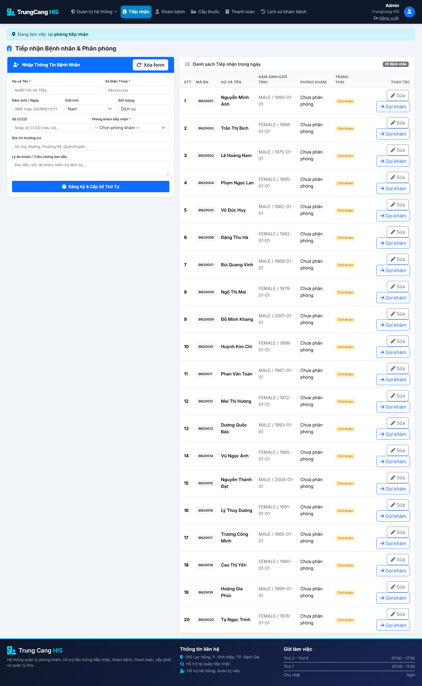

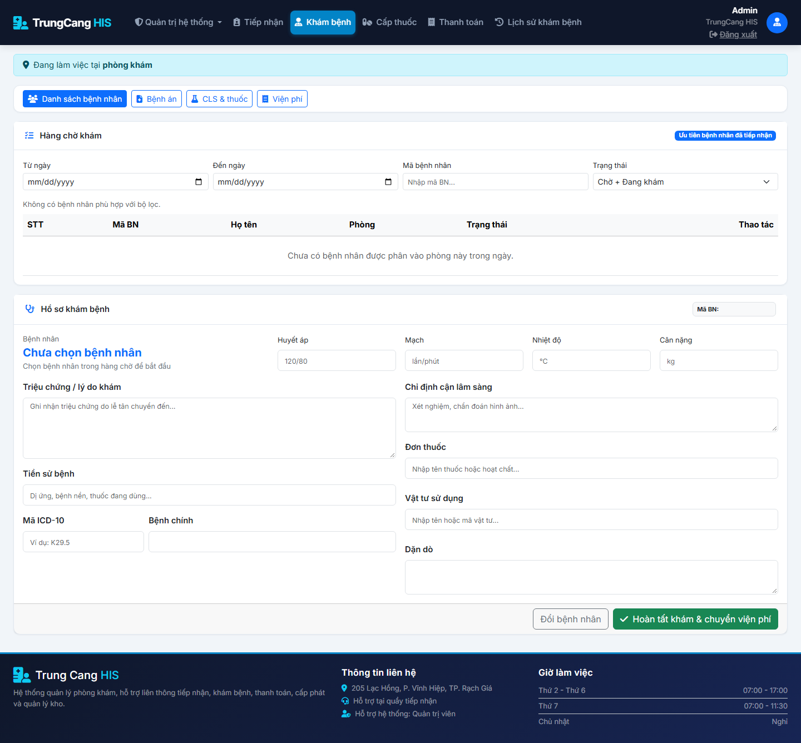

## 5.4. Thanh toán và cấp phát

Sau khi hoàn tất khám, lượt khám chờ thanh toán. Khi thanh toán thành công, hệ thống tạo hóa đơn; nếu có đơn thuốc/vật tư thì chuyển sang chờ cấp phát. Dược sĩ xác nhận cấp phát, service kiểm tra và trừ tồn theo lô còn khả dụng.

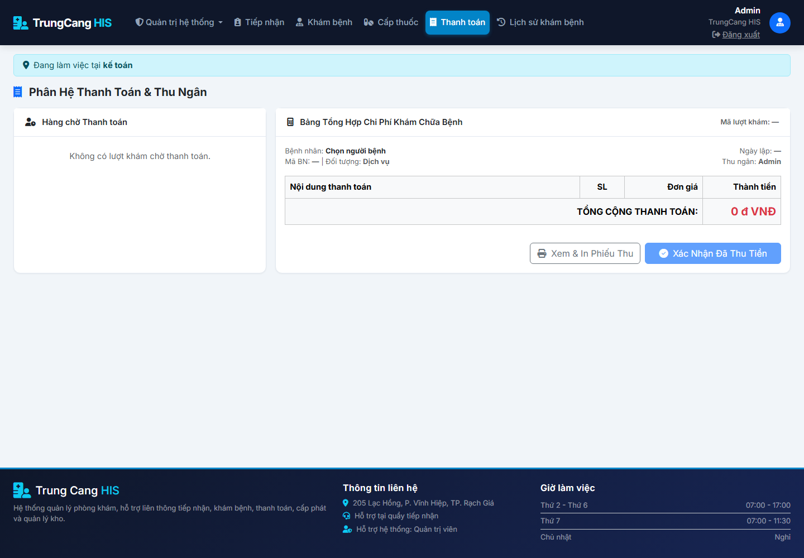

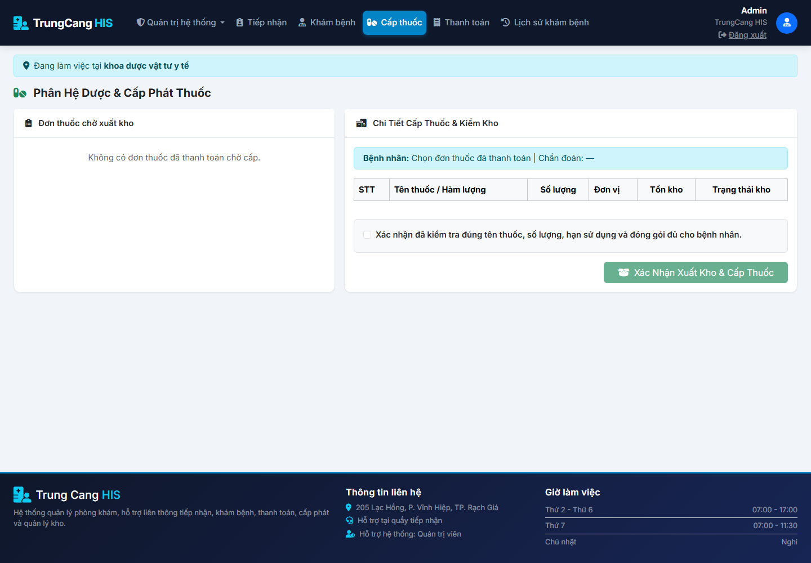

## 5.5. Quản lý kho và báo cáo

Trang quản lý kho phân biệt `MEDICINE` và `SUPPLY`, lọc theo kho, hiển thị đơn vị, tồn khả dụng và hạn gần nhất từ các lô còn hiệu lực. Trang báo cáo lọc dữ liệu theo ngày, phòng, trạng thái, hình thức thanh toán và hàng hóa; kết quả xuất được CSV, JSON và HTML.

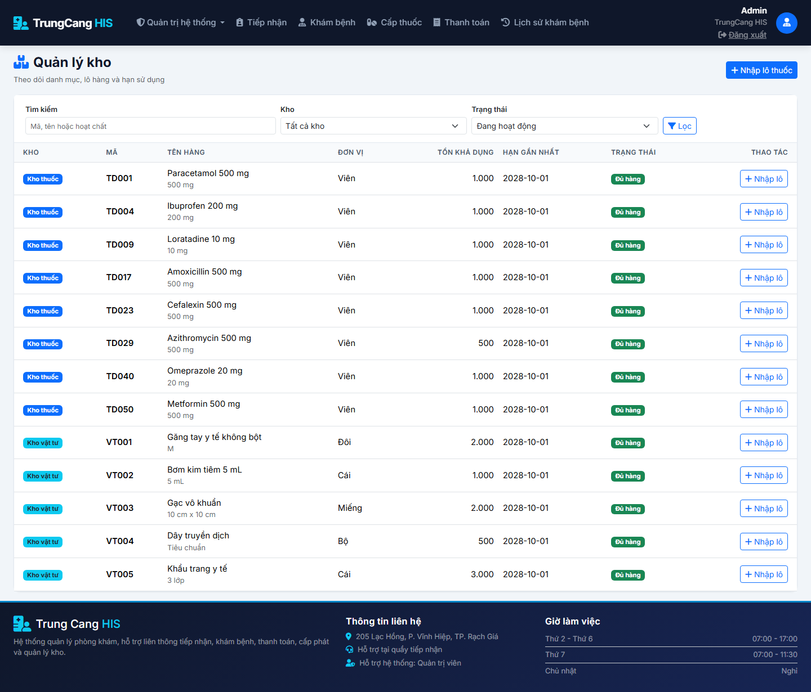

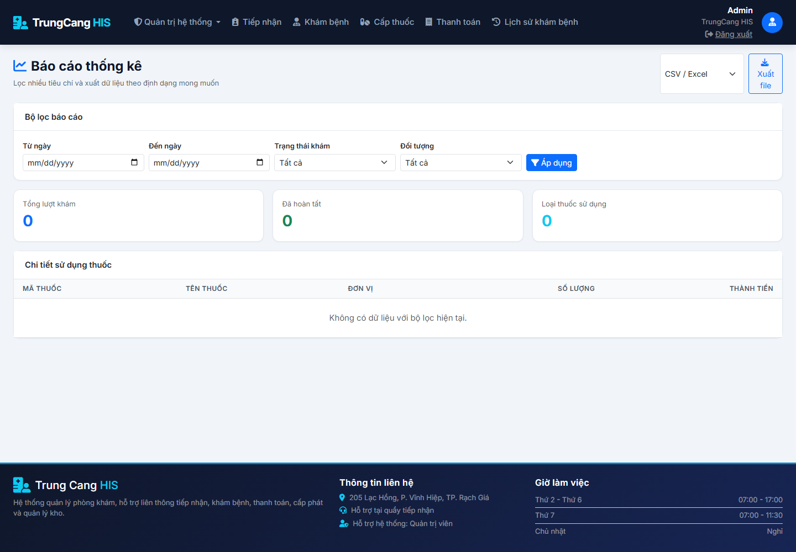

## 5.6. Lịch sử khám và kiểm thử

Lịch sử khám hỗ trợ tìm kiếm, lọc khoảng ngày và xem chi tiết thông tin khám đã lưu. Trong quá trình lập báo cáo, ứng dụng được chạy trên H2 trong bộ nhớ và dùng Playwright chụp giao diện. Bộ kiểm thử Maven đạt 40 test; test JavaScript đạt 13 test. Kiểm thử này không ghi dữ liệu vào MySQL.

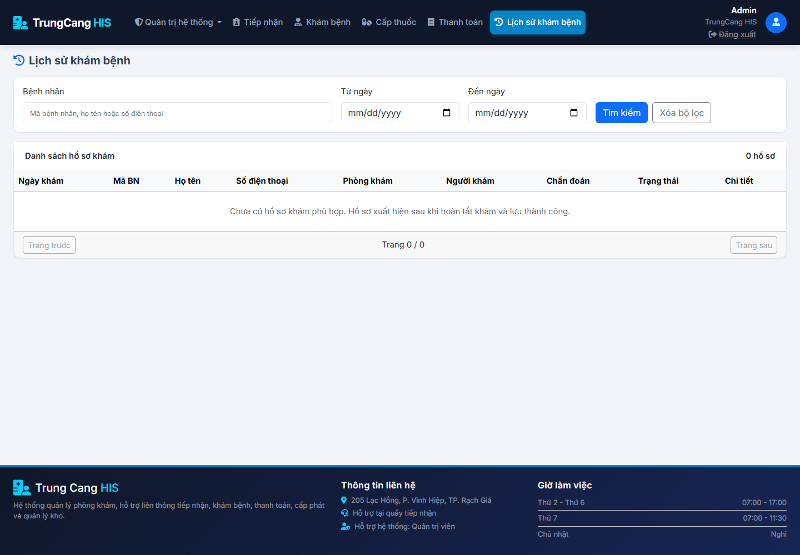

## 5.7. Kết luận chương

Chương 5 đã minh họa các phân hệ thực tế bằng giao diện TEST và đối chiếu với cấu trúc source. Các màn hình và sơ đồ không mô tả những nghiệp vụ chưa được tích hợp.

\newpage

# CHƯƠNG 6. KẾT LUẬN VÀ HƯỚNG PHÁT TRIỂN

## 6.1. Kết quả đạt được

Đề tài đã xây dựng được ứng dụng web mô phỏng quy trình khám ngoại trú cho Phòng khám Trung Cang. Hệ thống có xác thực phiên, phân quyền bốn vai trò, quản lý danh mục cơ bản, tiếp nhận, khám, ICD, thuốc/vật tư, thanh toán, cấp phát, kho, lịch sử khám và báo cáo. Luồng cấp phát cập nhật tồn lô; báo cáo có bộ lọc và xuất ba định dạng.

Về chất lượng, source được kiểm tra bằng Maven/H2, test JavaScript và Playwright trên dữ liệu TEST. Việc dùng H2 giúp kiểm thử không làm thay đổi database MySQL vận hành.

## 6.2. Hạn chế

Hệ thống hiện phù hợp với mục tiêu học tập và mô phỏng nghiệp vụ ở quy mô nhỏ. Hàng chờ tiếp nhận/khám vẫn dùng `localStorage`, do đó chưa bảo đảm đồng bộ nhiều máy. Dịch vụ/cận lâm sàng chưa đi vào luồng thanh toán. Một số nghiệp vụ chưa có gồm BHYT, nội trú, in chứng từ, ký số, tích hợp hệ thống ngoài và audit vận hành chuyên sâu.

## 6.3. Hướng phát triển

- Chuyển hoàn toàn tiếp nhận và hàng chờ sang database theo lượt khám được tạo ngay khi tiếp nhận.
- Tích hợp chỉ định/kết quả cận lâm sàng và chi phí dịch vụ vào hóa đơn.
- Bổ sung in phiếu khám, hóa đơn, đơn thuốc; báo cáo quản trị chuyên sâu.
- Mở rộng quản lý tồn, nhập/xuất/kiểm kê và cảnh báo tồn/hạn dùng.
- Hoàn thiện bảo mật, nhật ký thao tác, BHYT và tích hợp hệ thống y tế liên quan.

## 6.4. Kết luận chương

Đề tài đã đạt được mục tiêu xây dựng nền tảng TrungCang HIS cho quy trình khám ngoại trú cơ bản. Các phần chưa hoàn thiện được nhận diện rõ, là cơ sở cho các giai đoạn phát triển tiếp theo.

\newpage

# TÀI LIỆU THAM KHẢO

1. Spring, “Spring Boot Reference Documentation”, tài liệu chính thức.
2. Spring, “Spring Security Reference”, tài liệu chính thức.
3. Oracle, “Java Platform, Standard Edition 21 Documentation”.
4. MySQL, “MySQL 8.0 Reference Manual”.
5. Bootstrap, “Bootstrap Documentation”.
6. Tài liệu nội bộ dự án: `README.md`, `trung-cang-his-development.md`, source code và bộ kiểm thử TrungCang HIS, truy cập tháng 10 năm 2026.
